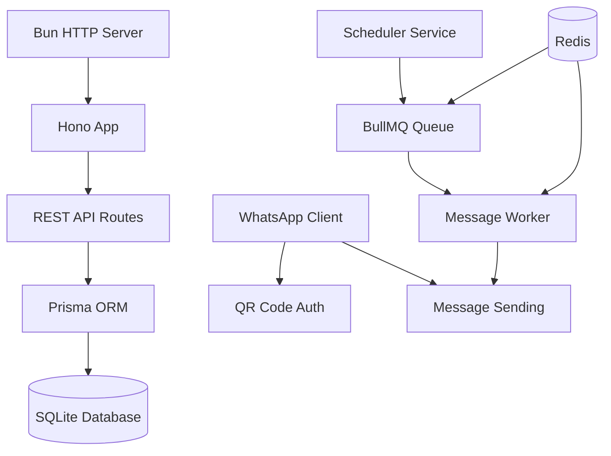

## Technology Stack

The WhatsApp Message Scheduler is built on a modern, performant stack designed for reliability and efficiency:

- **Bun**: JavaScript runtime and web server
- **Hono**: Lightweight web framework for building the REST API
- **Redis + BullMQ**: Message queue for job scheduling and processing
- **WhatsApp Web.js**: WhatsApp integration library
- **Prisma**: Database ORM for SQLite
- **SQLite**: Lightweight database for storing messages and profiles

## System Architecture



## Core Components

### 1. HTTP Server (Bun + Hono)

The application uses Bun's native HTTP server with Hono as the web framework:

```typescript src/server.ts
serve({
  fetch: app.fetch,
  port: Number(port),
});
```

Hono provides a lightweight, Express-like API with built-in middleware support:

```typescript src/app.ts
const app = new Hono();

app.use(logger());

// Register routes
app.route("/messages", messagesRoutes);
app.route("/people", peopleRoutes);
```

<Info>
Bun is significantly faster than Node.js for both startup time and runtime performance, making it ideal for this real-time messaging application.
</Info>

### 2. Database Layer

The application uses Prisma with SQLite for data persistence. The schema includes three main models:

```prisma prisma/schema.prisma
model AdminProfile {
  id          String   @id @default(cuid())
  name        String
  email       String
  password    String
  lastCheckIn DateTime @default(now())
}

model People {
  id      String    @id @default(cuid())
  name    String    @unique
  phone   String    @unique
  Message Message[]
}

model Message {
  id          String   @id @default(cuid())
  content     String
  sendTo      People   @relation(fields: [sendToPhone], references: [phone])
  sendToPhone String
  sendAfter   Float    @default(0)
  createdAt   DateTime @default(now())
}
```

<Note>
The `sendAfter` field stores the delay in **days** (as a float), which gets converted to milliseconds when scheduling.
</Note>

### 3. Message Queue (Redis + BullMQ)

BullMQ provides reliable job scheduling with Redis as the backing store:

```typescript src/queues/messageQueue.ts
import { Queue } from "bullmq";
import { redisConfig } from "../config/redis";

export const messageQueue = new Queue("messageQueue", {
  connection: redisConfig,
});
```

The queue configuration uses environment variables for Redis connection:

```typescript src/config/redis.ts
export const redisConfig = {
  url: process.env.REDIS_REST_URL,
  maxRetriesPerRequest: null,
};
```

### 4. Worker Process

The worker processes jobs from the queue and sends WhatsApp messages:

```typescript src/server.ts
const worker = new Worker(
  "messageQueue",
  async (job) => {
    try {
      await sendMessage(job.data.sendToPhone, job.data.content);
    } catch (error) {
      console.error("[WORKER ERROR]: Failed to send message", error);
    }
  },
  { connection: redisConfig, concurrency: 1 }
);
```

<Tip>
The worker runs with `concurrency: 1` to ensure messages are sent sequentially, preventing rate limiting issues with WhatsApp.
</Tip>

### 5. WhatsApp Integration

WhatsApp Web.js handles the WhatsApp connection and message sending:

```typescript src/services/w-web.ts
import { Client, LocalAuth } from "whatsapp-web.js";

const client = new Client({
  authStrategy: new LocalAuth(),
});

const sendMessage = async (phone: string, message: string) => {
  try {
    console.log(`Sending message: ${message.slice(0, 100)}... to ${phone}`);
    client.sendMessage(`${phone}@c.us`, message);
  } catch (error) {
    console.error("Error sending message:", error);
  }
};
```

## Application Flow

### Startup Sequence

1. **WhatsApp Client Initialization**: The client starts and waits for QR code authentication
2. **QR Code Display**: User scans the QR code with WhatsApp mobile app
3. **Client Ready**: Once authenticated, the server starts
4. **Message Scheduling**: All existing messages are scheduled into the queue
5. **Worker Activation**: The worker starts processing scheduled jobs

```typescript src/server.ts
client.on("qr", (qr) => {
  console.log("[QR RECEIVED]");
  qrcode.generate(qr, { small: true }, (code: string) => {
    console.log(code);
  });
});

client.on("ready", async () => {
  console.log("[CLIENT]: WhatsApp client is ready.");
  await startServer();
});

client.initialize();
```

### Message Lifecycle

1. **Creation**: Messages are created via the REST API and stored in SQLite
2. **Scheduling**: The scheduler service reads messages and adds them to the BullMQ queue with calculated delays
3. **Queue Storage**: Jobs are persisted in Redis with their delay times
4. **Processing**: When the delay expires, the worker picks up the job
5. **Delivery**: The worker calls `sendMessage()` to send via WhatsApp

## Design Decisions

### Why Bun?

Bun offers several advantages:
- Fast startup time for quick server restarts
- Native TypeScript support without transpilation
- Built-in web server with excellent performance
- Compatible with Node.js packages like WhatsApp Web.js

### Why BullMQ + Redis?

- **Persistence**: Jobs survive server restarts
- **Reliability**: Built-in retry mechanisms
- **Delayed Jobs**: Native support for scheduling messages in the future
- **Monitoring**: Easy to inspect job status and queue health

### Why SQLite?

- **Simplicity**: No separate database server needed
- **Portability**: Single file database easy to backup
- **Performance**: Fast for read-heavy workloads
- **Sufficient Scale**: Handles the application's needs efficiently

<Warning>
For production deployments with multiple server instances, consider migrating to PostgreSQL and using a Redis cluster for better concurrency.
</Warning>

## Next Steps

<CardGroup cols={2}>
  <Card title="Message Scheduling" icon="clock" href="/concepts/message-scheduling">
    Learn how the scheduling system works
  </Card>
  <Card title="WhatsApp Integration" icon="whatsapp" href="/concepts/whatsapp-integration">
    Understand the WhatsApp connection process
  </Card>
</CardGroup>